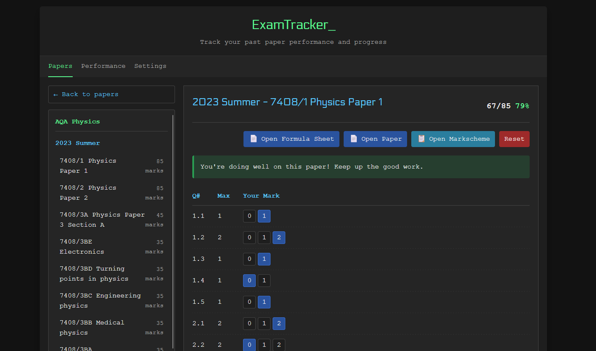

# ExamTracker

ExamTracker is a modern web application designed to help students track their performance on past examination papers. With an intuitive terminal-inspired interface, it allows users to record, analyze, and improve their exam preparation.



## Features

- **Paper Tracking**: Log your scores for individual questions on past papers
- **Subject & Exam Board Organization**: Filter papers by subject and examination board
- **Performance Analysis**: View your average scores and identify weak areas
- **Local Storage**: All data is stored locally in your browser for privacy
- **Export Functionality**: Export your data for backup or transfer between devices
- **Terminal-Inspired UI**: Clean, distraction-free interface designed for focus

## Getting Started

### Prerequisites

- [Node.js](https://nodejs.org/) (v16 or higher)
- [Bun](https://bun.sh/) (optional, for faster package management)

### Installation

1. Clone the repository:
   ```bash
   git clone https://github.com/gSUz92nc/ExamTracker.git
   cd ExamTracker
   ```

2. Install dependencies:
   ```bash
   # Using npm
   npm install
   
   # Or using Bun
   bun install
   ```

3. Start the development server:
   ```bash
   # Using npm
   npm run dev
   
   # Or using Bun
   bun run dev
   ```

4. Open your browser and navigate to `http://localhost:5173`

## Usage

1. **Select a Subject**: Choose from available subjects like Computer Science, Mathematics, etc.
2. **Choose an Exam Board**: Select the relevant examination board (OCR, AQA, Edexcel, etc.)
3. **Browse Papers**: View available past papers organized by year and season
4. **Mark Your Answers**: Select a paper and record your score for each question
5. **Analyze Performance**: Track your progress and identify areas for improvement

## Building for Production

To create a production version of your app:

```bash
npm run build
```

You can preview the production build with `npm run preview`.

## Deployment

The application is designed to work with Cloudflare Workers for easy deployment, although I'm sure you could use many other platforms

## Future Plans

- **Paper Import**: Ability to import paper information from PDF files
- **Possible Online Saving**: You will be able to access your data across all devices


## Contributing

Contributions are welcome! Please feel free to submit a Pull Request.

## License

This project is licensed under the MIT License - see the LICENSE file for details.

## Acknowledgments

- Built with [SvelteKit](https://kit.svelte.dev/)
- Deployed with [Cloudflare Workers](https://workers.cloudflare.com/)
- Terminal-inspired styling based on modern command-line interfaces
